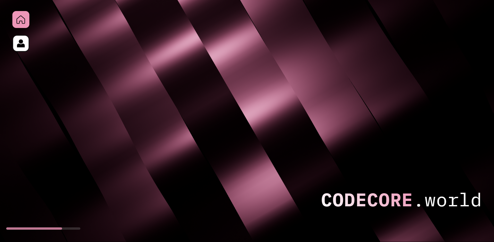

# CODECORE.world

A modern and interactive website for CODECORE - a development group showcasing cutting-edge web technologies and creative design.



## 🛠️ Tech Stack

- **Frontend**: React 18 with Vite
- **3D Graphics**: Three.js, React Three Fiber, React Three Drei
- **Animations**: Framer Motion, GSAP
- **Styling**: Styled Components, CSS3
- **Icons**: Lucide React
- **Routing**: React Router DOM

## 📦 Installation

1. **Clone the repository**
   ```bash
   git clone <repository-url>
   cd ReactJS-Website
   ```

2. **Install dependencies**
   ```bash
   npm install
   ```

## 🏃‍♂️ Running the Project

### Development Mode
```bash
npm run dev
```
This starts the development server at `http://localhost:3000`

### Production Build
```bash
npm run build
```
Creates an optimized production build in the `dist` folder

### Preview Production Build
```bash
npm run preview
```
Serves the production build locally for testing

## 🎯 Project Structure

```
src/
├── components/          # Reusable UI components
│   ├── Beams.jsx       # 3D beam background effect
│   ├── ElasticSlider.jsx # Interactive slider component
│   ├── GooeyNav.jsx    # Particle-based navigation
│   ├── LoadingScreen.jsx # Custom loading animation
│   └── Silk.jsx        # 3D silk background effect
├── pages/              # Main page components
│   ├── Home.jsx        # Landing page with beam effects
│   └── Contact.jsx     # Contact form and information
├── App.jsx             # Main application component
└── main.jsx           # Application entry point
```

## 🌐 Live Demo

Visit [CODECORE.world](https://codecore.world) to see the website in action.

## 📞 Contact

- **Email**: contact@codecore.world
- **Discord**: [Join our server](https://discord.gg/codecore)
- **GitHub**: [View our projects](https://github.com/codecore-world)

## 📄 License

This project is licensed under the MIT License - see the [LICENSE](LICENSE) file for details.

---

Built with ❤️ by the 0x1B, CodeCore Founder
